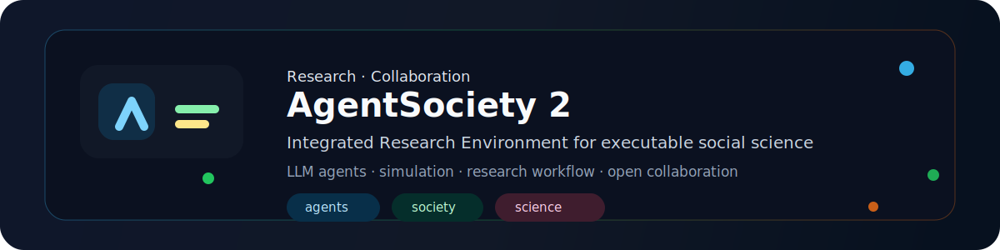
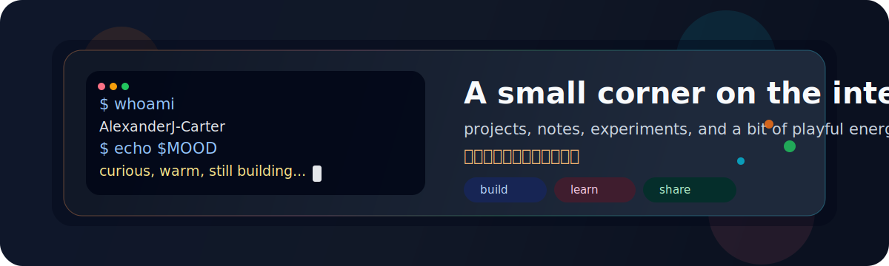

  

  
  
  
  

  🌤️ 日子不必很耀眼，但要很喜欢。 / Warm, not perfect. 
  <em>学生开发者 · LLM Agent 与可执行社会科学 / Student developer · LLM agents &amp; executable social science</em>

---

## Quick nav / 快速导航

[About](#about) · [Research](#research) · [Publications](#publications) · [Projects](#projects) · [Now](#now) · [Snake](#snake) · [Contact](#contact)

## About / 关于

- 📍 北京 / Beijing
- 🫖 清爽、稳定、长期主义 / neat, steady, long-term
- ✨ 好奇心、实践、持续记录 / curiosity, practice, public notes
- 🧩 软件 · 电子 · Linux · Verilog；把研究想法做成可运行系统 / software, electronics, Linux, Verilog — turning research ideas into runnable systems

> 长期更新的个人角落：研究协作、开源工程与生活实验。  
> A long-running corner for research collaboration, open-source engineering, and small experiments.

## Research / 研究

**LLM 驱动的社会智能体**、**可执行社会科学**，以及把假设变成可审计仿真与研究工作流的基础设施。  
**LLM-driven social agents**, **executable social science**, and infrastructure that turns hypotheses into auditable simulations and research workflows.

### Collaboration / 协作

主线协作：[AgentSociety](https://github.com/tsinghua-fib-lab/AgentSociety) / AgentSociety 2（扩展与配置、CI / 安全、文档、Windows 兼容、社会人仿真技能）。  
Primary collaboration: [AgentSociety](https://github.com/tsinghua-fib-lab/AgentSociety) / AgentSociety 2 (extension & config, CI / security, docs, Windows compatibility, socially grounded agent skills).

- Lab: [Tsinghua FIB Lab — AgentSociety](https://github.com/tsinghua-fib-lab/AgentSociety)
- Platform: [agentsociety2.fiblab.net](https://agentsociety2.fiblab.net/)
- Related platform paper: [AgentSociety (arXiv:2502.08691)](https://arxiv.org/abs/2502.08691)

  

## Publications / 论文

按时间倒序；新作在表顶追加一行。权威档案：[ORCID](https://orcid.org/0009-0007-0343-4129)。  
Newest first — append new rows at the top. Canonical record: [ORCID](https://orcid.org/0009-0007-0343-4129).

| Year | Title | Venue | Links |
| --- | --- | --- | --- |
| 2026 | [AgentSociety 2: An Integrated Research Environment for Executable Social Science](https://arxiv.org/abs/2607.11895) | arXiv preprint | [abs](https://arxiv.org/abs/2607.11895) · [pdf](https://arxiv.org/pdf/2607.11895) |

## Projects / 项目

### Featured / 精选

| Project | Role | Notes |
| --- | --- | --- |
| [AgentSociety](https://github.com/tsinghua-fib-lab/AgentSociety) | Contributor & co-author | LLM-native IRE for executable social science |
| [AgentSociety2-Agent-Skills](https://github.com/AlexanderJ-Carter/AgentSociety2-Agent-Skills) | Author | Theory-grounded skills for socially grounded agents |

### Selected / 自研精选

  
  

  
  

More / 更多：

- [MyCook](https://github.com/AlexanderJ-Carter/MyCook) · [cook.alexander.xin](https://cook.alexander.xin)
- [Git-Workflow-Lab](https://github.com/AlexanderJ-Carter/Git-Workflow-Lab) · [lab.alexander.xin](https://lab.alexander.xin)
- [linux-command](https://github.com/AlexanderJ-Carter/linux-command) · [linux-command.alexander.xin](https://linux-command.alexander.xin)

## Now & Skills / 此刻与技能

### Now

- AgentSociety 2 工程与社会人仿真技能 / AgentSociety 2 engineering and social-agent skills
- 软件、电子、Linux、Verilog 笔记 / Notes on software, electronics, Linux, and Verilog
- 慢一点，但一直向前 / Learning in public, slowly but consistently

  

### Skills

  

## Snake / 贡献轨迹

  <picture>
    <source media="(prefers-color-scheme: dark)" srcset="https://raw.githubusercontent.com/AlexanderJ-Carter/AlexanderJ-Carter/output/github-contribution-grid-snake-dark.svg" />
    
  </picture>

---

## Contact / 联系

- Website: [alexander.xin](https://alexander.xin)
- ORCID: [0009-0007-0343-4129](https://orcid.org/0009-0007-0343-4129)
- Publications: [list above](#publications)
- GitHub: [AlexanderJ-Carter](https://github.com/AlexanderJ-Carter)

欢迎交流研究、项目或有趣想法。 / Feel free to reach out about research, projects, or ideas.
